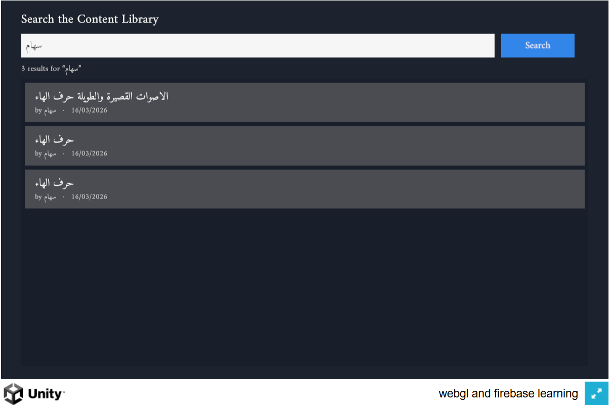

# BookLab — Task 2 Handover Document

**Search & Content Discovery (WebGL · Firebase)**

| | |
|---|---|
| **Author** | Ali Shehroz |
| **For** | Adeeb · Phase 1 Technical Assessment — Task 2 |
| **Live app** | https://adeeb-booklab-task2.web.app |
| **Repository** | https://github.com/alishehroz-ideo/webgl-and-firebase-learning |
| **Stack** | Unity 6 WebGL · Firebase Realtime Database · REST · TextMeshPro (Amiri) |

*This document is written for the reviewer. It explains what I built, the decisions behind it, and how it maps to the evaluation criteria — parsing robustness, search performance, code architecture, and scalability.*

---

## 1. Overview of the implementation

A search page over a content library stored in **Firebase Realtime Database**. The user types a **content name** or an **author name**, presses Search, and the matching items appear as **cards** showing Name, Author, and Date.

The catch — and the point of the task — is that the data is **real-world messy** and must be used **as-is**: the metadata is crammed into a single string field and I am **not allowed to clean or restructure it at the source**. So the application does all the tidying itself, in code, turning inconsistent strings into clean records — without ever crashing on a bad entry.

It is a Unity WebGL app, follows **MVC + event-driven** architecture, and **reuses the Core** built for Task 1 (the Firebase REST client, the event bus, the UI factory).



## 2. The data challenge

Each item's metadata lives inside one field whose key **ends with `CoverInfo`** (it is prefixed by the item id, e.g. `71726852CoverInfo` — so the field name itself is not fixed). The real format, reverse-engineered from the live data, is roughly:

```
Name _ Author _ Date _ Type _ Subject|Grade|Term _ Tag
```

…but in practice the data:

- uses **mixed separators** (`_` and `|`),
- has a **variable number of fields**,
- can be **missing** fields (no author, no date),
- carries **extra junk** (tags, type, grade), and
- mixes **RTL Arabic** with **LTR** dates and Latin names.


**The rule:** the source stays untouched. The app reads it as-is and extracts Name / Author / Date programmatically.

## 3. Parsing approach — the core (data parsing robustness)

**Decision: parse by _shape_, not by _position_.** The naive approach — split on `_` and take `parts[1]` as the author — breaks the instant a field is missing or reordered: on a single-field entry it throws; on a reordered entry it grabs the wrong piece. My parser never assumes a fixed slot.

**The algorithm** (`CoverInfoParser`):

1. Split the string on `_` into top-level tokens.
2. **Find the date by its shape** — a `dd/mm/yyyy` pattern (also tolerant of `d/m/yyyy`) — *wherever* it sits. Digits look the same in RTL or LTR, so this anchor holds even in the Arabic entries.
3. The **author** is the field immediately **before** the date.
4. The **name** is **everything before the author**, re-joined with `_` (so an underscore inside a name survives).
5. Everything **after** the date (type / subject / tag, even if it contains its own `_`) is extra and ignored.
6. If there is **no date**, fall back to a best-effort guess, flag it **low-confidence**, and never crash.
7. The original string and a **confidence** flag are always kept — nothing is lost, and a half-broken entry is *marked* rather than silently wrong.

**The real code:**

```csharp
// dd/mm/yyyy (also tolerates d/m/yyyy). Digits look the same in RTL or LTR,
// so this anchor holds even in the Arabic entries.
static readonly Regex DateRx = new Regex(@"^\s*\d{1,2}/\d{1,2}/\d{4}\s*$", RegexOptions.Compiled);

public static ParsedContent Parse(string raw)
{
    var result = new ParsedContent { Raw = raw, Confidence = ParseConfidence.Invalid };
    if (string.IsNullOrWhiteSpace(raw)) return result;   // empty → safe nulls

    var tokens = raw.Split('_');                          // top-level fields

    // 1) find the date by SHAPE, wherever it sits
    int dateIdx = -1;
    for (int i = 0; i < tokens.Length; i++)
        if (DateRx.IsMatch(tokens[i])) { dateIdx = i; break; }

    if (dateIdx >= 0)
    {
        result.Date = tokens[dateIdx].Trim();

        // 2) author = the field right before the date; name = everything before that
        if (dateIdx >= 2)
        {
            result.Author = Clean(tokens[dateIdx - 1]);
            result.Name   = Clean(string.Join("_", tokens, 0, dateIdx - 1));  // re-join name
        }
        else if (dateIdx == 1) { result.Name = Clean(tokens[0]); result.Author = null; }
        // dateIdx == 0 -> nothing before the date: name & author both missing

        result.Confidence = result.HasName ? ParseConfidence.High : ParseConfidence.Low;
    }
    else
    {
        // 3) no date anywhere -> best-effort fallback, flagged low-confidence, never a crash
        result.Name   = tokens.Length > 0 ? Clean(tokens[0]) : null;
        result.Author = tokens.Length > 1 ? Clean(tokens[1]) : null;
        result.Confidence = result.HasName ? ParseConfidence.Low : ParseConfidence.Invalid;
    }
    return result;
}

// Trim, and treat an empty/whitespace field as "missing" (null) rather than "".
static string Clean(string s) => string.IsNullOrWhiteSpace(s) ? null : s.Trim();
```

**Proof on real entries** (taken straight from the live `StoryLibary`):

| Raw `CoverInfo` | → Name | → Author | → Date | Why it's tricky |
|---|---|---|---|---|
| `الكسور_amna_13/04/2025_Education_Math\|Three\|Second_كسور` | الكسور | amna | 13/04/2025 | Arabic name + Latin author; all junk after the date dropped |
| `مصنع__09/02/2026_Education_Scinese\|One\|Second_` | مصنع | *(null)* | 09/02/2026 | **Missing author** (`__`) — position parsing would misalign |
| `مركز مصادر التعلم_سامح_06/04/2024_…_#مصادر_الصبيخي` | مركز مصادر التعلم | سامح | 06/04/2024 | Trailing tag contains its **own `_`** — still ignored |
| `قصة_No Name_06/01/2025_UserContent_None_…` | قصة | No Name | 06/01/2025 | Real oddity — kept **as-is** |
| `""` / whitespace | *(null)* | *(null)* | *(null)* | Empty → safe nulls, `Invalid` confidence, **no crash** |

**Why this is robust:** it is **rule-based** (deterministic, fast, free — no ML, no network), the rules are **shape-based** (they look at what each piece *is*, not where it sits), it has a **safe fallback**, and it is **not hardcoded** to any id or entry. The parser design is a small strategy: a `ParsedContent` model + the shape rules, easily extended (e.g. a second date shape) without touching callers.

## 4. Explanation of the architecture (code architecture)

**MVC + event-driven**, reusing Task 1's Core. The three roles are separate and never call each other — they communicate through two events on the shared `EventBus`.


| Role | Class(es) | Responsibility |
|---|---|---|
| **Model** | `SearchService`, `CoverInfoParser`, `ParsedContent` | loads from Firebase, parses, holds & searches the clean in-memory list |
| **View** | `SearchView` | the input box, Search button, and result cards — renders whatever arrives |
| **Controller** | `SearchController` | turns a search event into results via the service |
| **Events** | `SearchRequested`, `SearchResults` | the only wiring between View and Controller |

**The event flow:** the View publishes `SearchRequested(query)` when the user searches; the Controller handles it, asks the service, and publishes `SearchResults` (the list, plus `Loading` / `Error` flags); the View renders. Screens stay decoupled and independently testable.

```csharp
class SearchRequested { public string Query; }
class SearchResults   { public List<ParsedContent> Results; public bool Loading; public bool Error; }
```

## 5. Data loading, caching & error states

*(The assessment's video/document points include "asset loading & caching" and "how data is saved & loaded." This feature is **read-only** — it saves nothing — so this section covers how data is **loaded and cached**, and how loading/error are handled.)*

- **Firebase integration** — one `GET` via the reused `FirebaseClient` fetches the whole `StoryLibary`. The `CoverInfo` is located by the **"key ends with `CoverInfo`"** rule (never a hardcoded id).
- **Cache** — every item is parsed **once** on load and the clean list is held in memory. Search then never re-fetches or re-parses.
- **Loading & error states** are first-class:

| State | What the user sees |
|---|---|
| **Loading** | "Loading…" while the library is fetched |
| **Error** | "Couldn't load the library — check the connection and try again." |
| **Ready** | results as cards; search is instant |

The failure detection is defensive: an empty/`null`/unreachable response returns `false`, and the whole parse is wrapped in a `try/catch`, so a malformed entry logs and returns safely — never a crash.

```csharp
public async Task<bool> LoadAsync()
{
    string json = await FirebaseClient.GetJson(FirebaseEndpoints.StoryLibrary());
    if (string.IsNullOrEmpty(json) || json == "null") return false;   // unreachable/empty → error
    try {
        var root = JObject.Parse(json);
        foreach (var story in root.Properties())
            _all.Add(CoverInfoParser.Parse(FindCoverInfo(story)));
        return true;
    }
    catch (Exception e) { Debug.LogError(e.Message); return false; }   // malformed → error, no crash
}
```

## 6. Search & performance (search performance)

The expensive work — parsing — happens **once**, at load. After that, a search is a plain **in-memory scan** of the clean list: the query is lowercased once, then each item's **name or author** is matched (case-insensitive substring). No network trip, no re-parsing. This is **instant and smooth for the stated 1,000+ items**.

```csharp
foreach (var item in _all) {
    bool nameHit   = item.Name   != null && item.Name.ToLowerInvariant().Contains(q);
    bool authorHit = item.Author != null && item.Author.ToLowerInvariant().Contains(q);
    if (nameHit || authorHit) results.Add(item);   // name OR author
}
```

## 7. Scalability discussion (required)

**Question:** *If the dataset grows to 10,000+ items, how would you redesign this system to improve performance?*

**Why the simple design stops scaling:** it downloads **all** items and parses **all** of them in the browser, on a single WebGL thread, on every visit. Fine at 1,000; at 10,000+ it becomes a large download plus a visible freeze — repeated for every user.

**Redesign — do the heavy work once, off the browser; send each user only what they need:**

1. **Precompute a clean index.** A **Firebase Cloud Function** runs the same parser **once** (and re-runs only when an item changes), writing clean `{name, author, date}` records into a **separate** `/searchIndex` node. The original messy data is never modified (still honouring "don't touch the source"), and the browser now reads clean data with **zero parsing on load**.

   ```
   /StoryLibary   ← ORIGINAL messy data (never modified)
   /searchIndex   ← CLEAN, indexed copy the function writes (new)
   ```

2. **Server-side, indexed queries.** With an indexed field (`.indexOn`), the browser sends a targeted, paginated request and Firebase **jumps** to the matches instead of scanning everything:

   ```
   GET /searchIndex.json?orderBy="author"&startAt="wafa"&endAt="wafa"&limitToFirst=20
   ```

   The browser only ever downloads the ~20 matches — never the other 9,980+.

3. **Or a dedicated search service** (Algolia / Typesense / Elasticsearch) for instant, typo-tolerant, match-in-the-middle, multi-field search at any scale.

**Honest limitation:** Firebase's built-in query is "starts-with, one field at a time." For match-in-the-middle, typo-tolerance, or name+author together, a dedicated search service is the right tool — but the principle is identical: the browser only ever receives the few matches.

**Where AI fits at scale:** the offline index-builder (and cleaning the low-confidence stragglers) is a legitimate place for an LLM — run **once, offline**, never in the live search path.

## 8. Key decisions & challenges

- **Parse in memory, never at the source.** The rule forbids cleaning Firebase, so the app builds a clean copy in its own memory on load. The source stays messy and untouched.
- **Shape, not position.** The single most important call for robustness — it survives reordering, mixed separators, and missing fields where `parts[1]` would crash.
- **Real Arabic in WebGL.** The data is Arabic, and WebGL has **no OS font fallback**, so the built-in font renders blanks. I bundled the **Amiri** font and render with **TextMeshPro**, plus letter-shaping + RTL (`ArabicSupport.Fix`). A subtle bug — cards blanking when the font atlas rebuilt mid-build — was fixed by **pre-warming the atlas** with every glyph in one pass before creating the cards.
- **Loading & error as real states.** Empty, unreachable, or malformed data all resolve to a clear on-screen message — never a blank screen or a crash.

## 9. Use of AI tools

I built this with **Claude Code** as a pair-programmer. We reasoned through the messy-data edge cases together and landed on the shape-anchored parser; it wrote much of the Search feature alongside me, which I reviewed and adjusted; it was a real help diagnosing the Arabic-in-WebGL font issue; and it helped shape *where* AI belongs at scale (offline index-building, not the live search path). It sped the build up — the direction, the decisions, and the understanding are mine.

## 10. Tech stack, running & deploying

| Item | Detail |
|---|---|
| Engine | Unity **6000.4.3f1** (URP), Input System, TextMeshPro, Newtonsoft JSON |
| Backend | Firebase **Realtime Database** (node `StoryLibary`) — read over REST |
| Text | **Amiri** font bundled for Arabic (WebGL has no OS fallback) |
| Run in editor | Open the project, load the `task2` scene, press **Play** |
| Build | per-task WebGL build; deploy via `firebase/deploy-hosting.sh` (hosting target `task2`) |
| Live | https://adeeb-booklab-task2.web.app |
| Repository | https://github.com/alishehroz-ideo/webgl-and-firebase-learning |

**Deliverables:** Git repository · live WebGL build · this handover document · video walkthrough.

*Content data is real assessment data used as-is. Arabic rendering uses the Amiri font (SIL Open Font License).*
