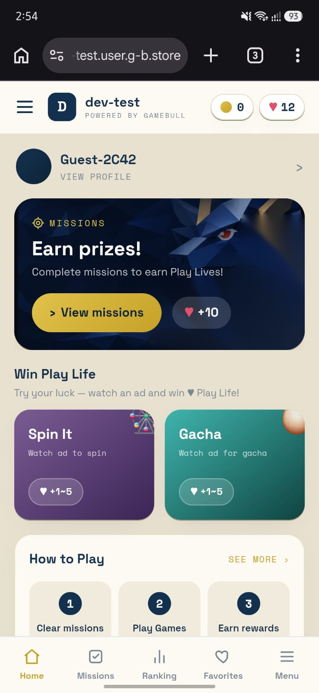
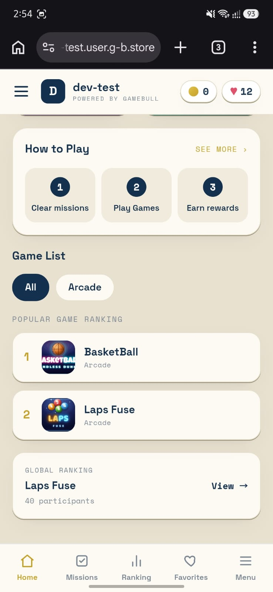
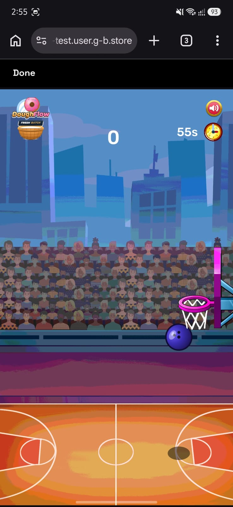
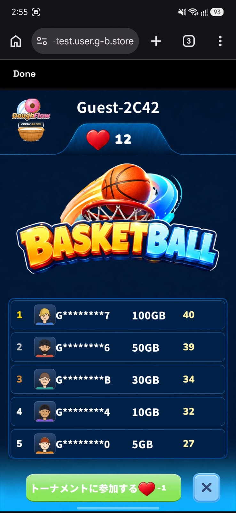
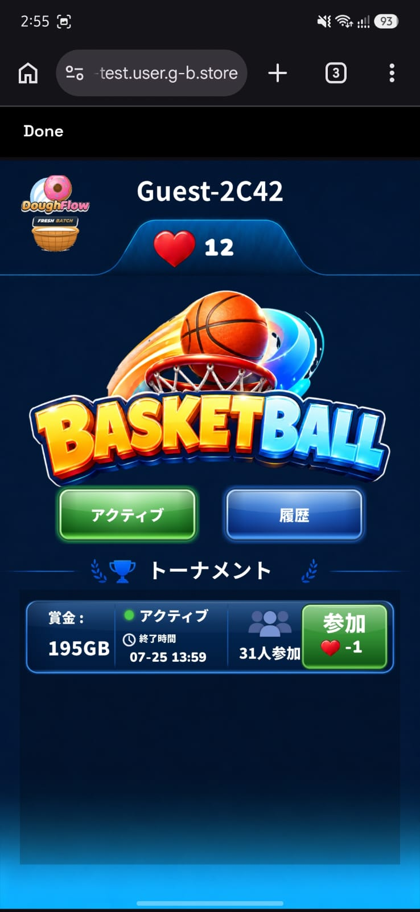
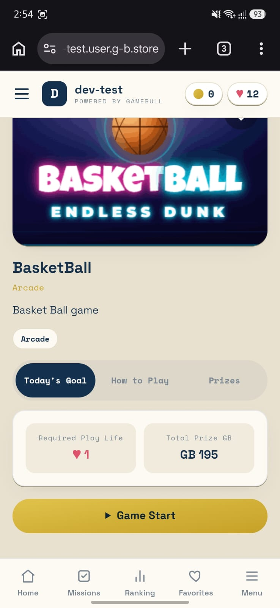

# Selected Work — A Snapshot

**Ali Shehroz** · Unity Developer
*Supplementary to the Adeeb Phase 1 Technical Assessment*

These are **a few representative projects** — a sample to show the range I work across, **not a complete list**. Each is real, shipped or demoed work, with a live link or a narrated video walkthrough.

**Core skills shown here:** Unity · C# · WebGL builds &amp; templates · REST API integration (Newtonsoft JSON) · the full Firebase platform (Authentication · Realtime Database · Analytics · Cloud Functions) · VR interaction systems · Virtuix Omni hardware integration · Unity ML-Agents.

| Project | What it demonstrates | How to see it |
|---|---|---|
| **GameBull** | WebGL + REST at production scale | screenshots (below) · live on request |
| **EmberBound** | Full Firebase suite on mobile, incl. Cloud Functions | narrated video |
| **VR Simulation** | VR + Virtuix Omni hardware + ML-Agents AI | video |

*Below: one page per project. This is a curated selection — happy to share more on request.*

---

## GameBull — WebGL Casual-Gaming Platform  *(company project)*

**What it is:** A browser-based **WebGL** casual-gaming platform for an Asian market — a portal hosting multiple arcade games, with guest/user profiles, a *"Play Lives"* energy system, missions and ad-based rewards (Spin, Gacha), **global leaderboards**, and **in-game tournaments**.

**My role (Unity Developer):** I made the games **WebGL-ready** — building their controls and the **WebGL template/build** — and **integrated the platform's REST APIs** into the games, fetching and pushing live data (scores, leaderboards, Play Lives, tournaments) over HTTP using **Newtonsoft JSON** in Unity. *(The backend APIs were built by the backend team; I consumed them in-engine.)*

**Why it's relevant:** It is the exact skill set this assessment tests — a **Unity → WebGL** front-end talking to a **backend over REST** — but at production scale, with real users and live data.

**Link:** Live in a dev environment — available on request.

{width=31%} {width=31%} {width=31%}

{width=31%} {width=31%} {width=31%}

*GameBull — main hub · game catalog & rankings · live gameplay · global leaderboard · in-game tournaments · direct play.*

## EmberBound — Unity Mobile Game on the Firebase Suite  *(company project)*

**What it is:** A Unity mobile game built on the **full Firebase platform** — **Authentication** (sign-in), **Realtime Database** (game data), **Analytics** (player telemetry), and **Cloud Functions** (server-side logic).

**My role (Unity Developer):** built the game and integrated the Firebase suite end-to-end.

**Why it's the perfect counterpart to this assessment:** Task 1 and Task 2 talk to Firebase over **REST**, because the Firebase SDK does not run in WebGL. EmberBound uses the **native Firebase SDK** on mobile — so together they show I understand Firebase **across platforms**, and that I have shipped real **Cloud Functions** — the exact mechanism I proposed for Task 2's 10,000-item scalability redesign.

**Video walkthrough (narrated):** <https://drive.google.com/file/d/1VWiBGMu2Bu6xJX0fawogOh4UmXga3r1b/view>

## Immersive VR Simulation — Unity ML-Agents + Virtuix Omni  *(a simulation company)*

**What it is:** A full-body **VR training simulation** built in Unity, combining **Unity ML-Agents**, the **Virtuix Omni** omnidirectional treadmill, and VR interaction — the user physically walks and navigates a simulated space while **AI agents respond and adapt in real time**.

**My role (Unity Developer):** built the **VR control & interaction system**, integrated **real-time movement and tracking from the Virtuix Omni** treadmill, and created the **enemy behaviour using Unity ML-Agents** — agents trained to react to the player in real time.

**Why it's relevant:** breadth well beyond web and mobile — real **hardware integration**, **VR systems**, and **ML-driven AI** in Unity. Applicable to training simulations, experiential learning, and VR prototyping.

**Video:** <https://1drv.ms/v/c/20249f5ad3268347/IQBHgybTWp8kIIAgGQQAAAAAAcdfFea4VXnEElxgxp-gSbY>
